# 🛡️ BountyPilot

### Cybersecurity • Bug Bounty • OSINT • Web Security Workstation

**BountyPilot** is an Android security workstation designed for **authorized security testing, bug-bounty research, reconnaissance, web assessment, OSINT, traffic analysis, evidence collection, and security-report preparation** from a mobile device.

> ⚠️ **Authorized use only.** Use BountyPilot only against systems, applications, accounts, networks, cameras, APIs, and data that you own or have explicit permission to assess. Respect program scope, rate limits, privacy requirements, and applicable law.

<p align="center">
  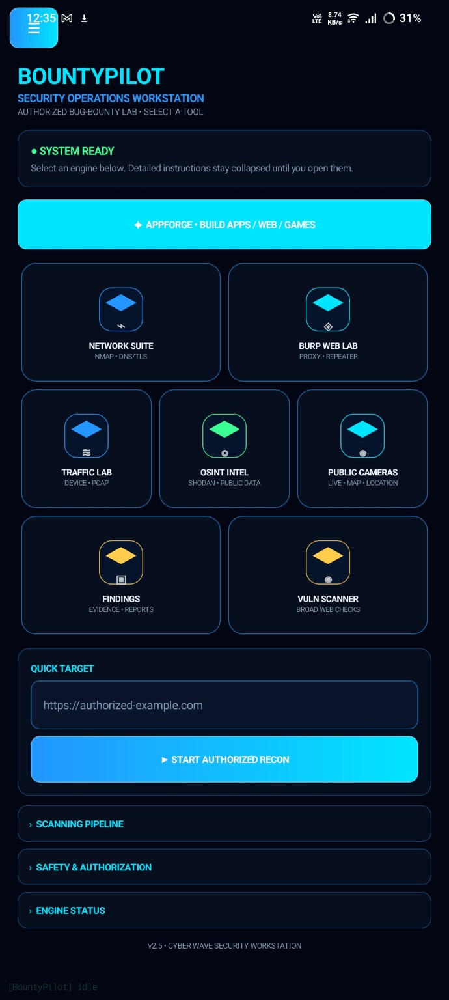
</p>

## ✨ What is BountyPilot?

BountyPilot brings multiple security workflows into one Android interface instead of forcing a researcher to jump between unrelated utilities.

It combines:

- 🔎 Network discovery and service inventory
- 🌐 HTTP/web testing utilities
- 🧭 OSINT and public-data research
- 🛡️ Low-impact vulnerability assessment
- 📡 Device traffic and PCAP workflows
- 📷 Public-by-design camera intelligence
- 🧪 Synthetic vulnerability training
- 📝 Evidence, findings, and report preparation
- ⚙️ External security-tool workflows through supported Android/Termux paths
- ✦ AppForge / CodeForge AI project generation and export

The application is intentionally built around an **authorization-first workflow** and makes a distinction between observations, candidate findings, reproduced behavior, and confirmed security impact.

---

## 🚀 BountyPilot 4.3

Current Android build configuration:

| Property | Value |
|---|---|
| Version | **4.3.0** |
| Version code | **36** |
| Application ID | `com.bountypilot.app` |
| Compile SDK | **35** |
| Target SDK | **35** |
| Minimum SDK | **26** |
| Java / Kotlin target | **17** |
| Platform | **Android** |

### AppForge 4.3 changes

- AppForge uses a dedicated landscape workspace.
- The rest of BountyPilot remains portrait-oriented.
- BUILD PROJECT validates generated projects and produces build instructions.
- BountyPilot no longer automatically launches an external terminal when BUILD is pressed.
- Generated projects are stored under the app's private `appforge_projects` directory.
- EXPORT PROJECT TO DOWNLOADS creates a ZIP and offers the Android share sheet.
- COPY PROJECT PATH makes it easier to continue work in Code on the Go or another build environment.
- Android APK compilation still requires an Android/Gradle build engine; the APK does not bundle a complete Android compiler toolchain.

---

# 🧰 Core Security Modules

## 🔵 Network Suite

<p align="center">
  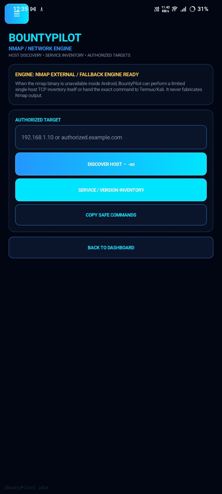
</p>

The Network Suite provides an Android-friendly network reconnaissance workflow for authorized targets.

### Includes

- Host discovery workflow
- Nmap integration / external fallback path
- Single-host TCP service inventory
- Service/version inventory workflow
- DNS utilities
- TLS inspection utilities
- Safe command-copy workflow
- Termux/Kali-compatible external command handoff where supported

When an Nmap binary is unavailable inside Android, BountyPilot can fall back to a limited TCP inventory path. It does **not** fabricate Nmap output.

---

## 🔷 Burp Web Lab

<p align="center">
  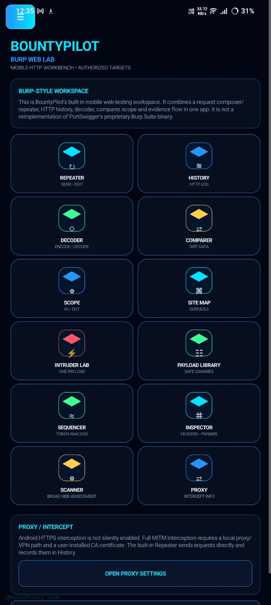
</p>

A built-in mobile HTTP workbench inspired by common web-testing workflows.

### Workspace tools

- Repeater — send and edit authorized HTTP requests
- HTTP History — review requests and responses generated by the app
- Decoder — URL and Base64 encoding/decoding
- Comparer — compare request/response data
- Scope — keep testing targets organized
- Site Map — track discovered web surfaces
- Intruder Lab — controlled payload-testing workflow
- Payload Library — safe/authorized test payload organization
- Sequencer — token-analysis workflow
- Inspector — headers and parameter inspection
- Proxy settings
- Web scanner

> **Important:** BountyPilot's Burp Web Lab is its own mobile HTTP workbench. It is **not a reimplementation of PortSwigger's proprietary Burp Suite binary**.

### Proxy / interception boundary

Android HTTPS interception is not silently enabled. Full MITM interception requires an explicit local proxy/VPN path and an appropriate user-installed CA certificate. The built-in Repeater can send requests directly and record them in History without pretending to be a transparent MITM proxy.

---

## 🟢 OSINT Intelligence

<p align="center">
  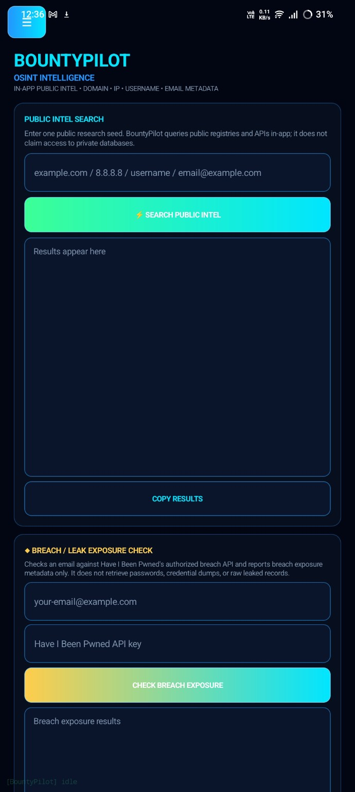
</p>

BountyPilot provides a public-information research hub for authorized OSINT workflows.

### Research seeds can include

- Domain names
- IP addresses
- Usernames
- Email addresses
- Public profile references
- Public phone-number references

### Public-data integrations / workflows include

- DNS and public DNS resolution
- Certificate Transparency lookups
- RDAP domain/IP information
- Public GitHub/GitLab profile references
- Public social-profile URL construction
- Search-engine based public research
- Shodan API workflow
- Other documented public APIs where configured

BountyPilot does **not** claim access to private databases merely because a public identifier is supplied.

---

## 🟡 Breach / Leak Exposure Check

The OSINT hub can check an authorized email address against the **Have I Been Pwned API** when the user supplies their own API key.

The workflow is designed to return **breach-exposure metadata**, not passwords, credential dumps, or raw leaked records.

> Use only email addresses you are authorized to investigate and follow the provider's API terms.

---

## 🟣 Public Camera Intelligence

<p align="center">
  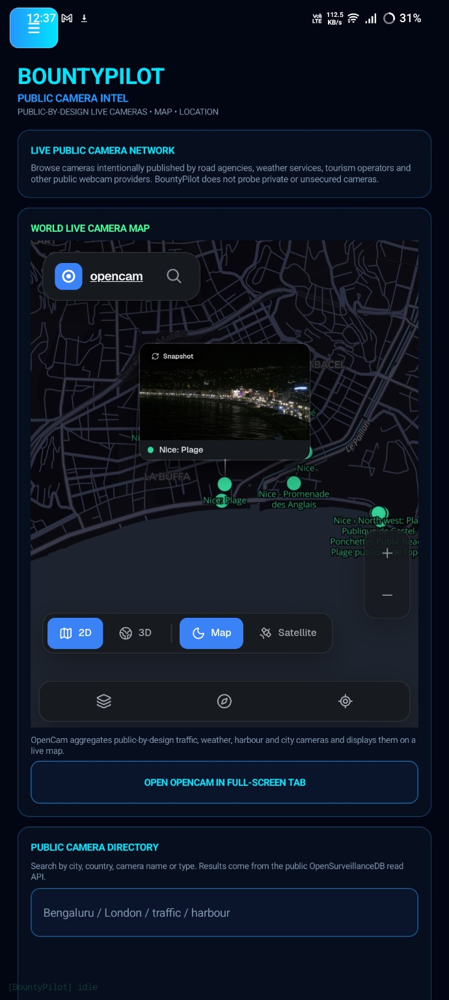
</p>

BountyPilot includes a public-camera intelligence workflow focused on cameras intentionally published for public viewing.

### Includes

- Public camera map
- Public camera directory search
- City / country / camera-type searches
- Nearby public-camera discovery
- Camera details
- Public image/feed viewing
- OpenCam integration/workflow
- OpenSurveillanceDB public metadata
- Map and location references

BountyPilot does **not** attempt to access private, password-protected, or unsecured cameras merely because they are discoverable.

The Android application does not require camera or location permissions for this public-camera intelligence workflow.

---

## 📡 Traffic Lab

<p align="center">
  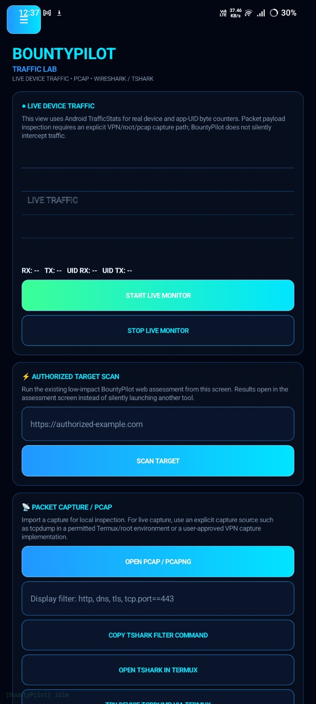
</p>

The Traffic Lab combines Android device traffic counters with explicit packet-capture workflows.

### Includes

- Live RX/TX device counters
- App/UID traffic counters where available
- Authorized web-surface scanning
- PCAP / PCAPNG import
- Display-filter workflow
- TShark command generation
- Termux TShark handoff
- Wireshark-compatible PCAP workflow

> Packet payload inspection requires an explicit capture source such as a permitted Termux/root capture environment or a user-approved VPN capture implementation. BountyPilot does **not silently intercept device traffic**.

---

## 🟠 Vulnerability Scanner

<p align="center">
  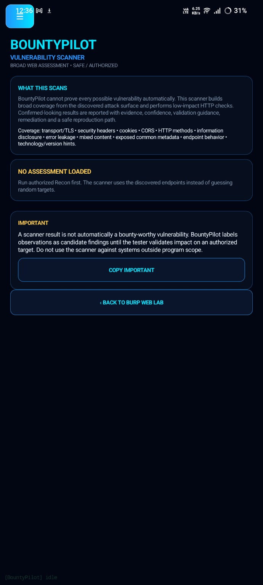
</p>

The Vulnerability Scanner performs broad, low-impact web checks against an authorized target and discovered attack surface.

### Coverage includes

- Transport / TLS observations
- Security headers
- Cookies
- CORS behavior
- HTTP methods
- Information disclosure
- Error leakage
- Mixed content
- Common exposed metadata
- Endpoint behavior
- Technology/version hints

Results are designed to include:

- Evidence
- Confidence
- Validation guidance
- Remediation guidance
- Safe reproduction path

### Finding philosophy

A scanner observation is **not automatically a bounty-worthy vulnerability**.

BountyPilot separates:

`Observation → Candidate → Manual Validation → Reproduced Behavior → Confirmed Impact`

This helps reduce false positives and discourages submitting unverified scanner output as a real security finding.

---

# 🧪 Training / Demo Lab

<p align="center">
  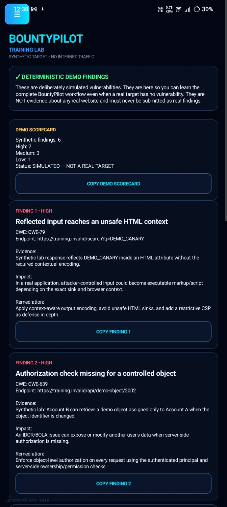
</p>

The Training Lab uses deliberately synthetic findings so the complete security workflow can be practiced without attacking a real target.

The demo environment includes examples such as:

- Reflected input reaching an unsafe HTML context
- Missing object-level authorization
- Evidence collection
- Severity classification
- Impact explanation
- Remediation guidance
- Finding-by-finding report preparation

**Training findings are synthetic and must never be reported as vulnerabilities in a real website.**

---

# 📝 Findings & Report Builder

<p align="center">
  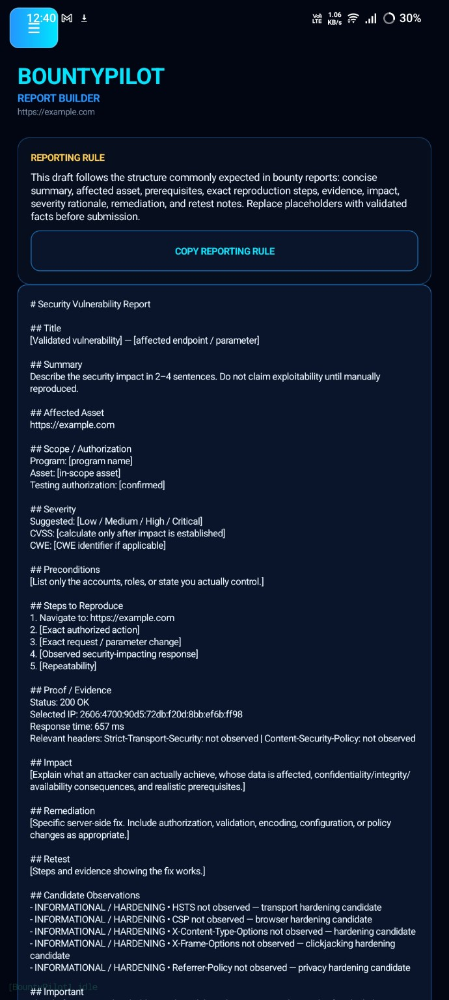
</p>

BountyPilot includes a report-oriented workflow for turning validated observations into structured security reports.

### Report structure

- Title
- Summary
- Affected asset
- Scope / authorization
- Severity
- CWE / CVSS references where applicable
- Preconditions
- Exact reproduction steps
- Proof / evidence
- Security impact
- Remediation
- Retest instructions
- Candidate observations

The report builder is designed to encourage **validated, evidence-backed reporting** rather than copying raw scanner output into a bounty submission.

---

# ✦ AppForge / CodeForge AI

<p align="center">
  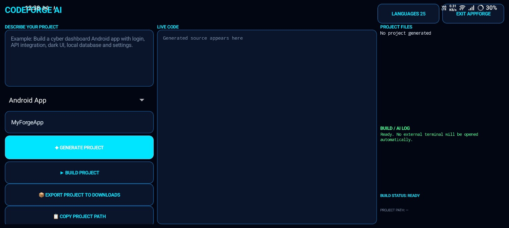
</p>

AppForge is BountyPilot's built-in project-generation workspace.

### Current workflow

1. Describe the project.
2. Select the project language/type.
3. Generate the project.
4. Inspect generated source.
5. View the generated project tree.
6. Validate the project with BUILD PROJECT.
7. Export the project as a ZIP.
8. Copy the local project path.
9. Continue building in a suitable external build environment when required.

### Build boundary

BountyPilot can generate and validate project structures, but an Android APK still needs an Android/Gradle build engine such as Code on the Go or another suitable development environment.

AppForge does **not** silently launch Termux to perform an Android build.

---

# 🖼️ Screenshots

## Dashboard


## Network Suite


## Burp Web Lab


## OSINT Intelligence


## Vulnerability Scanner


## Public Camera Intelligence


## Traffic Lab


## Training Lab


## AppForge


## Report Builder


---

# 🧠 Security Workflow

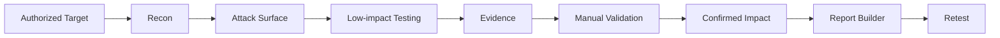

BountyPilot is intended to keep authorization and validation visible throughout this process.

---

# 🧩 Architecture Overview

```text
┌────────────────────────────────────────────────────────────┐
│                     BOUNTYPILOT ANDROID                    │
├────────────────────────────────────────────────────────────┤
│                    Security Workstation UI                 │
├──────────────┬──────────────┬──────────────┬───────────────┤
│ Network      │ Web Lab      │ OSINT        │ Traffic       │
│ Nmap/TCP     │ HTTP/Proxy   │ Public Data  │ Stats/PCAP    │
│ DNS/TLS      │ Repeater     │ HIBP/Shodan  │ TShark        │
├──────────────┼──────────────┼──────────────┼───────────────┤
│ Vuln Scanner │ Cameras      │ Training     │ Findings      │
│ Safe Checks  │ Public APIs  │ Synthetic    │ Reports       │
├──────────────┴──────────────┴──────────────┴───────────────┤
│                    Authorization Layer                     │
├────────────────────────────────────────────────────────────┤
│ Android APIs • Internet • Termux bridge • External tools   │
└────────────────────────────────────────────────────────────┘
```

---

# 📁 Project Structure

```text
bp22/
├── app/
│   └── src/main/
│       ├── AndroidManifest.xml
│       ├── java/com/bountypilot/app/
│       │   └── MainActivity.kt
│       └── res/
├── assets/
│   └── screenshots/
├── build.gradle.kts
├── settings.gradle.kts
├── gradle.properties
├── APPFORGE_V4.3_NOTES.md
└── README.md
```

---

# 🔐 Permissions & Privacy

The current Android manifest requests:

- `android.permission.INTERNET`
- `com.termux.permission.RUN_COMMAND`

The application does **not** request Android camera or location permissions for the public-camera intelligence workflow.

Some features can send data to external public APIs or services when the user explicitly invokes them. Review the provider's terms, API requirements, and privacy implications before use.

Do not place API keys, passwords, tokens, private URLs, or other secrets in source code or Git history.

---

# 🛠️ Build Requirements

For Android development/building, the project targets:

- Android SDK 35
- Minimum Android API 26
- Java 17
- Kotlin/JVM target 17
- Android Gradle build tooling compatible with the project

For external security workflows, some features may use or hand off to tools such as Nmap, Metasploit, TShark, Wireshark, or Termux depending on the user's environment.

### Android build boundary

The BountyPilot APK itself does not contain every compiler/runtime needed to build arbitrary Android projects generated by AppForge. Use a suitable Android/Gradle environment for final APK compilation.

---

# 📲 Typical Authorized Bug-Bounty Workflow

```text
1. Confirm program permission and exact scope
        ↓
2. Add the authorized target
        ↓
3. Run controlled reconnaissance
        ↓
4. Map services / endpoints / public attack surface
        ↓
5. Perform low-impact validation
        ↓
6. Save useful evidence
        ↓
7. Manually reproduce interesting behavior
        ↓
8. Confirm security impact
        ↓
9. Build a concise evidence-backed report
        ↓
10. Retest after remediation
```

---

# ⚠️ Responsible Use

BountyPilot is a security research and learning tool. The project is **not** an authorization bypass.

Do not use it to:

- Access accounts you do not own or have permission to test.
- Scan infrastructure outside an approved program scope.
- Attempt to obtain private camera feeds.
- Capture traffic belonging to other users without authorization.
- Exfiltrate credentials or private data.
- Submit synthetic training findings as real vulnerabilities.
- Ignore API terms, program rules, rate limits, or legal restrictions.

Only test what you are explicitly authorized to test.

---

# 🗺️ Roadmap

Possible future improvements include:

- More modular security engines
- Better evidence storage and export
- More advanced endpoint visualization
- Expanded authorized web-testing workflows
- Improved AppForge generation/editing capabilities
- Better build-error diagnostics
- Additional local/offline capabilities
- More structured project templates

Roadmap items are **future plans**, not promises of current functionality.

---

# 🤝 Contributing

Contributions, bug reports, feature ideas, UI improvements, and security-focused testing are welcome.

Before submitting a security issue, avoid posting credentials, API keys, private target data, or sensitive exploit evidence publicly.

For changes:

```bash
git clone https://github.com/farhanfxS/BountyPilot.git
cd BountyPilot
```

Create a focused change, test it on an authorized environment, and submit a clear pull request describing what changed and how it was tested.

---

# 👤 Author

**Farhan Ahmed**

BountyPilot is an independent Android cybersecurity / bug-bounty workstation project focused on practical mobile security research and learning.

**Repository:** https://github.com/farhanfxS/BountyPilot

---

# 📌 Project Status

**BountyPilot 4.3.0 — Security + AppForge Workstation**

The repository contains an actively developed Android security-workstation codebase. Some workflows depend on external Android tools, public APIs, Termux, or a suitable build environment.

---

## ⭐ If you find the project useful

Star the repository, test it only in authorized environments, and share improvements that make mobile security research safer and more practical.
